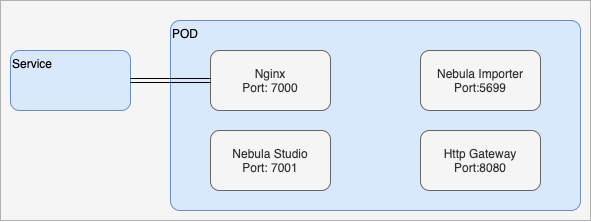

## 背景
为什么会有这个话题呢。首先当然是最近使用了Nebula Graph，然后Nebula Graph官方的在Kubernetes上部署Nebula Graph的方式推荐采用 Oprtator的模式。那么有一些思考随之而来了：
- Helm模式的支持如何，首先我个人认为Helm模式和Operator模式在成熟的云原生应用软件上是必选的，说必选的意思是，你至少实现一个。
- Nebula Graph 我开始接触的时候呢，已经有了Helm的模式，目前的版本里面（2.5）提供了Operator的模式，但是Helm的Chart还是存在的，只不过实现已经发生的一点点变化，这个Chart创建的只是一个Operator实现的CRD资源了。
- 那么对于Nebula Graph其他周边的工具，譬如CLI，Studio是不是有很好的Kubernetes的创建支援了，至少目前没有。就Studio而言，目前仅提供了RPM、docker-compose等部署的指南和参考，并没有提供在Kubernetes上的编排实现。

话说软件正在吞噬整个世界，而云原生正在吞噬整个软件，所以提供完备的云原生的解决方案对于一个成熟产品来说，未来会是必经之路。当然数据库软件是一个比较特殊的领域，目前还有大部分的数据库软件基于性能的考量会在部署时优先考虑物理服务器直接部署的方式，但我相信趋势的力量，终有一天这会成为过去，而像Snowflake那样的技术栈会大行其道。

本文主要介绍自己给出的一个在Kubernetes上部署Nebula Graph Studio的Helm实现。

⚠️ 注意：因为这个Helm还刚刚实现，会不时地更新，所以本文未来也会不时地更新以适配代码的变化。

## 当前的实现
考虑官方当前没有提供Kubernetes的资源，但是官方已经给出了一个docker-compose的实现，因此，基于这个现有的实现做一次Porting，并不是十分困难。

鉴于Nebula importer和studio之间存在的共享存储，同时又考虑到大部分的Kubernetes测试和生产环境，并不一定能提供RWX的storageClass，因此，第一次实现我采取了一个Pod里面塞进了4个Container的方案。参考下图：



具体代码的实现放置在这儿： [matrixji/nebula-studio-helm](https://github.com/matrixji/nebula-studio-helm)

## 一次快速的部署

快速地部署一个Nebula Graph Studio的实例起来。

我们通过NodePort的方式在 30070端口创建一个可以访问的Nebula Studio：

```shell
$ helm repo add nebula-graph https://matrixji.github.io/nebula-studio-helm/
$ helm repo update
$ helm upgrade --install my-studio \
      --set service.type=NodePort \
      --set service.port=30070 \
      nebula-graph/nebula-studio
```

接下来就可以使用浏览器通过节点的IP和30070端口访问相应的Web服务了。


## 未来可能的改进

- 由于Nebula Studio提供的是Web 服务，因此未来可以考虑支持Ingress的配置，并且可以考虑移除目前存在的Nginx代理容器。
- 由于多个容器间实际都提供了单独的功能，也可以考虑将他们分裂成多个Pod，当然在此之前，这需要一个方案去处理可能需要的共享存储的问题。
- 争取向官方的Repo 进行回源、合并，毕竟未来由官方提供Support 才是最靠谱的。

## 最后：安利一下 helm/chart-releaser

最后，安利大家一个小工具，如果你也希望通过Github pages 来发布Helm Chart，这个工具无疑是一个能够快速集成的利器。

[helm/chart-releaser](https://github.com/helm/chart-releaser) 


## UPDATES

- PR: [PR30](https://github.com/vesoft-inc/nebula-studio/pull/30) for merge to official repository - 2021/10/15