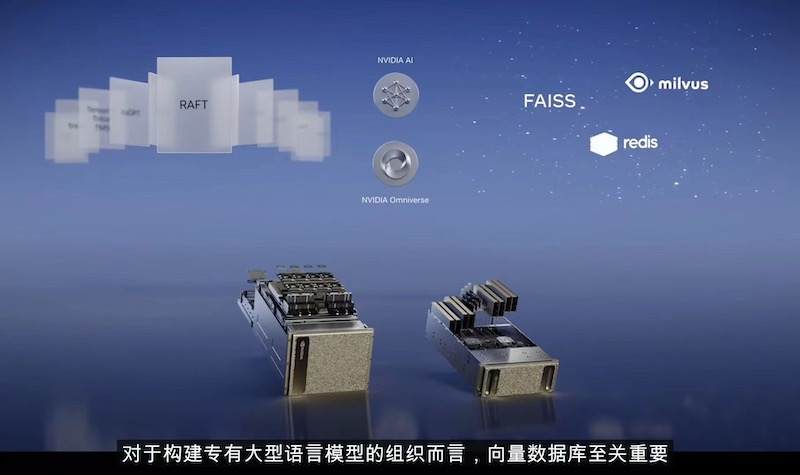
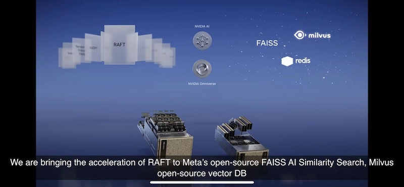
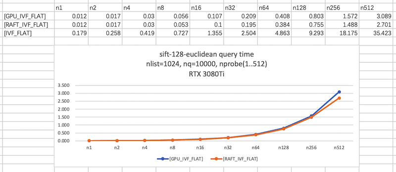
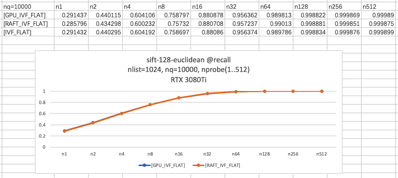
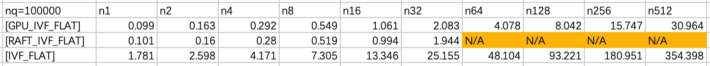
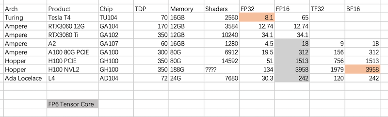

## 背景

GTC 2023 正在如火如荼的进行中。“皮夹克”提到了向量数据库，提到了Milvus，也提到最近Rapids在向Faiss以及Milvus提交的RAFT索引。
下面这两张Slides在朋友圈被刷屏了……





RAFT 为何物？到底是不是向量数据库的银弹？

## Rapids & RAFT
RAFT 全名 Reusable Accelerated Functions and Tools，从名字上来看就是工具集合。而非那个知名的分布式算法[Raft](https://en.wikipedia.org/wiki/Raft_(algorithm))。Github [rapidsai/raft](https://github.com/rapidsai/raft) 属于Rapidsai的一个项目。

如果说RAFT可能是向量数据库的银弹的话，那么Rapids从目标上看至少是个核弹，Rapids的目标很明确：AI和数据相关的业务，Nvidia都需要接管，而且是全流水线的接管，如果说大数据的处理可以分成控制面和数据面的话，那么Rapids希望数据面全部在GPU里面完成，CPU做一些业务上的控制就完了。所以Rapids几乎需要把大数据的生态全部在GPU上实现一遍（至少是主流的方向上的一个完整流水线）。所以就有了一些耳熟能详的数据科学的软件在Rapids生态下面被重新实现了：
- [cuDF](https://github.com/rapidsai/cudf) 对应 [pandas](https://pandas.pydata.org/)
- [cuML](https://github.com/rapidsai/cuml) 对应 [scikit-learn](https://scikit-learn.org/)

当然[numpy](https://numpy.org/)对应的[cupy](https://github.com/cupy/cupy)之前已经有开源的实现了。

RAFT作为一个加速函数库，实现诸如：稀疏矩阵、空间算法、基础的类聚等等的基础算法。而临近搜索自然也被包含在里面了，目前看RAFT实现的临近算法主要 IVFFlat, IVFPQ, BruteForce(Flat)。

## Knowhere 上Raft的表现
申明：测试数据、设备比较单一，所以可能存在以偏概全的观点。

[Knowhere](https://github.com/milvus-io/knowhere)是向量数据库Milvus的向量引擎。最近主线上已经合并了RAFT索引的支持，当然Faiss上RAFT索引的实现，可能还有一段路要走，感兴趣的可以关注：[Integrate RAFT FlatIndex / Distances](https://github.com/facebookresearch/faiss/pull/2707)。

因此这次的测试基本是基于Knowhere现有的Benchmark的代码，主要测试了IVF_FLAT索引在Faiss索引和RAFT索引下的表现（是不是有点绕，Milvus提供了Faiss的索引，也提供了RAFT的索引实现，然后未来Faiss可能大概率也会支持RAFT索引）。

测试基于 benchmark_knowhere_float.cpp 中的代码完成，测试数据集为：sift-128-euclidean，这是一个包含1000000的数据集,IVFFlat 测试代码中使用了nlist=1024，nq 使用 10000，然后测试nprobe从 1，2，4 ... 一直到 512的情况。top k的取值代码中是100。

直接看结果吧：

先看查询性能（本次没有关注索引构建的时间），至少在单一查询上看不出太大的区别，RAFT最好的时候有10%左右的性能优势。当然比CPU好太多了，我都不好意思把CPU的测试值放图上。


再看召回率的情况，两者几乎一致，没有差别（毕竟索引参数一致嘛），当然还是有些细微的差别，这个暂时没时间去深入了，可能后面关注索引构建过程的时候再看这个问题了。

随后，尝试增大nq看，看是否RAFT能够有更好的表现。于是乎就得到了下面这组数据：


在测试nprobe=64的时候，RAFT索引内存不足了（显存，原谅我只有12G的显存）。当然整个测试过程中发现RAFT的显存开销明显都会偏大。
稍微看了一下RAFT中的代码，因为RAFT使用rmm管理内存，rmm可以认为是C++17 中的std::pmr::polymorphic_allocator 在GPU上的一个实现（好吧，虽然我用C++17，但是似乎从来没有用过std::pmr）。当RAFT执行IVFFlat搜索的时候，需要申请一块这么大的内存：

```c++
  auto pool_guard = raft::get_pool_memory_resource(mr, n_queries * n_probes * k * 16);
  if (pool_guard) {
    RAFT_LOG_DEBUG("ivf_flat::search: using pool memory resource with initial size %zu bytes",
                   pool_guard->pool_size());
  }
```

在我们这儿，当 nprobe=64的时候，这个大小大是： `100000*64*100*16` 这就接近10G了。

## 后续
后面还会在陆续做一些测试，也会及时的给大家分享出来。

## 展望
总体来说，个人以为RAFT是一个比较新的索引实现，能够一出现（RAFT相关索引的代码从Github历史看大约也就在22年年底行成）就获得略优于Faiss的性能，确实体现了老黄做好Rapids的决心。Faiss的代码可以说久经沙场了，虽说写的不够Modern，但是老当益壮啊。当然未来其实更加看好的是RAFT在图索引上实现GPU的加速，有兴趣的可以关注这个Issue的进展：[Port CAGRA to RAFT](https://github.com/rapidsai/raft/issues/997) 应该是一个效率很高的索引，当然从目前看到Issue上的信息看有 “A100, fp32->fp16”，大致是使用FP16，要知道在A100上。FP16是使用Tensor Core实现的，算力直逼 312TFLOPS。所以回到开头的问题RAFT是不是向量数据库的银弹？至少目前不是，但是未来可能是个核弹……

正好最近整理了几块NV显卡的算力对比情况（数据可能不精准，但应该不会大差……）有些是用过的，有些是想用的 :-)


放在以前Faiss上，你说要选一块卡做向量搜索，哪块卡性价比好，如果不考虑电费的话，当然我会告诉你用消费卡，因为Faiss设置了CUBLAS_MATH_DISALLOW_REDUCED_PRECISION_REDUCTION，所以不会去使用TF32来加速。大家比拼的就是FP32的能力。3080 Ti都可以把A100 按在地上摩擦 ……

当然，你可以手动修改Faiss的代码，甚至可以在T4这样的显卡上使用FP16来运算，这样在矩阵乘法阶段你大约可以得到8倍的性能提升（当然代价是精度损失，召回率降低）

而如果你的场景不需要100%召回的话，那么未来你有希望看到在H100 NVL2这样的怪兽身上…… 但是，你发现没有消费卡都完全没有提Tensor Core的，这就是“皮夹克”厉害的地方。
