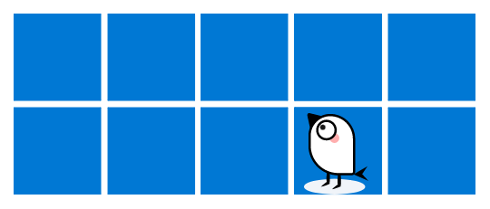

## Brief

Currently, I'm trying to port Milvus to windows, and now it seems to work well with standalone mode.

As merge back to upstream seems a very long story, so I put some notes on this page.

If you want to try some testing/developing work under windows with windows native Milvus, this could be a reference for quickstart.

## Get Windows version of milvus2

You could get the code from [matrixji/milvus at windows-dev](https://github.com/matrixji/milvus/tree/windows-dev) and compile it by yourself.

Or you could download the build artifacts from [Releases - matrixji/milvus](https://github.com/matrixji/milvus/releases).

### Build from source

#### Install MSYS enviroument

Firstly, we using mingw64/MSYS compile Milvus under windows, and you could get it from [MSYS2](https://www.msys2.org/).

After MSYS2 is installed, you should start to do the below steps under the shell **MSYS2 MinGW 64-bit**

Do system update and install git for clone code.

```shell
$ pacman -Su
$ pacman -S git
```

#### Clone the code

```shell
$ git clone git@github.com:matrixji/milvus.git -b windows-dev
```

I using `windows-dev` branch to tracking all changes for support windows compile. This branch rebase from [milvus-io/milvus](https://github.com/milvus-io/milvus) weekly.

#### Compile and package

Install tools needed for compile:

```shell
$ cd milvus
$ scripts/install_deps_msys.sh
```

**Important: Relaunch  the MinGW shell after first install success.**

Continue to compile and package Milvus:

```shell
$ make
$ sh scripts/package_windows.sh
```

If everything is fine, you will finally get a zip file under the `windows_package` folder. This is the whole zip you need to startup Milvus under windows, including minio.exe and etcd.exe.

**Note**

- As some third-party resources are hosted on Github, a proper proxy setting may be needed.
- Milvus 2 is written by golang, for download modules faster, goproxy is recommended, see: https://goproxy.cn

### Download artifacts directly

You could also find the prebuilt zip under [Releases - matrixji/milvus](https://github.com/matrixji/milvus/releases) if you don't want to compile it from the source.

Please use the release with `windows-test-` prefix, like `windows-test-v8`.


## Start Milvus

After you unzip the zip file, you will see several bat files under `milvus` folder.

### Startup
- `run_minio.bat` will run a MinIO server locally, and it will store data under the subfolder `s3data`.
- `run_etcd.bat` will run an etcd server locally with default configurations.
- And now you could run `run_milvus.bat` for starting the standalone milvus server.

### Testing with hello_milvus.py

After milvus started, you could try following the official guide to using hello_milvus.py for testing it.

The official guide: https://milvus.io/docs/v2.0.0/example_code.md

The pymilvus is a pure python library, so it is already available under windows.

