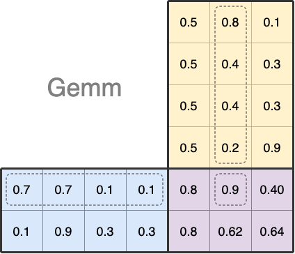

最近一直在看一些GPU和向量数据库的一些内容。出一些相关的技术笔记（暂且用一些吧）。

## 近似搜索中的距离

通常说到向量的比较，就离不开向量的距离。在浮点数的向量中，用的比较多的，同时在Faiss这样的向量库中支持的就要数L2距离和IP距离了。

### L2

L2距离，即欧式距离（Euclidean Distance），参考公式：

$$ d(a,b) = \sqrt{\sum _{i=1}^n (b_i - a_i)^2} $$

所以当a和b完全一致的时候，那么 $ d(a,b) = 0 $

### IP

IP距离，即内积距离（Inner Product），参考公式：

$$ p(a,b) = \sum _{i=1}^n (a_i * b_i) $$

### Cosine

提到内积距离，不得不提一下余弦距离（Cosine Similarity）

$$ d(a,b) = \frac{\sum_{i=1}^n (a_i * b_i)}{\sqrt{\sum _{i=1}^n{a_i^2}}\sqrt{\sum _{i=1}^n{b_i^2}}} $$

所以通常余弦距离的使用会将向量进行归一化（Normalize）之后计算IP距离来使用。归一化之后那么上面公式的分母即为1。

### 归一化

上面说到的归一化，通常说的其实是L2 Norm，用公式表示：

$$ x'_i = \frac{x_i}{\sqrt{\sum _{i=1}^n {x_i^2}}} $$

## 距离的计算

前面说了，在实际应用计算过程中，经常会使用IP来替代余弦距离，所以先看IP距离的实现。

### IP 的代码实现

下面是一个C++的参考实现（我们使用vector来存储float数据）：

```c++
float clac_distance_ip(const std::vector<float> &a, const std::vector<float> &b) {
    assert(a.size() == b.size());
    auto ret = 0.f;
    for (int i=0; i<a.size(); ++i) {
        ret += a[i] * b[i];
    }
    return ret;
}
```

当然如果你使用Python，并且使用numpy的话，就简单多了：
```python
>>> import numpy
>>> numpy.inner([0.5, 0.5, 0.5, 0.5], [0.8, 0.4, 0.4, 0.2])
0.9000000000000001
>>>
```

近似搜索的本质是在一堆的向量中寻找和自己最近的那个或者那几个，所以在n个向量中寻找和m个向量中每个最近的若干个向量是经常需要面对的场景。

我们在没有引入索引的概念之前，做这件事情最好的方式暴力计算n和m之间的两两距离，然后进行排序。

例如，我们要在 $ (0.5, 0.5, 0.5, 0.5), (0.8, 0.4, 0.4, 0.2), (0.1, 0.3, 0.3, 0.9) $ 里面查找和 $ (0.7, 0.7, 0.1, 0.1) $ 以及 $ (0.1, 0.9, 0.3, 0.3) $ 
最接近的两个向量是多少。理论上我门需要求出3*2（2组，每组三个结果）共计6个IP距离值。然后在每一组（3个）中进行排序（正规化的前提下，IP距离越大则表明越相似，最大值为1）。

而这种批量的计算，正好就是经典的矩阵点积乘了：

$$
\begin{bmatrix}
0.7 & 0.7 & 0.1 & 0.1 \\\\
0.1 & 0.9 & 0.3 & 0.3 \\\\
\end{bmatrix}
{*}
\begin{bmatrix}
0.5 & 0.8 & 0.1 \\\\
0.5 & 0.4 & 0.3 \\\\
0.5 & 0.4 & 0.3 \\\\
0.5 & 0.2 & 0.9 \\\\
\end{bmatrix}
{=}
\begin{bmatrix}
0.8 & 0.9 & 0.39 \\\\
0.8 & 0.62 & 0.61 \\\\
\end{bmatrix}
$$

这个计算代码实现这里就不展开说了，使用numpy，自然能够非常方便的得到：
```python
>>> a = [[0.7, 0.7, 0.1, 0.1], [0.1, 0.9, 0.3, 0.3]]
>>> b = [[0.5, 0.5, 0.5, 0.5], [0.8, 0.4, 0.4, 0.2], [0.1, 0.3, 0.2, 0.9]]
>>> numpy.dot(a, numpy.transpose(b))
array([[0.8 , 0.9 , 0.39],
       [0.8 , 0.62, 0.61]])
>>>
```
如上，乘之前，需要将b进行转置，是的a的列和b的行数相等。

这里显然和 $ (0.7, 0.7, 0.1, 0.1) $  最近似的是 $ (0.8, 0.4, 0.4, 0.2) $，他们之间的IP距离可以认为是0.9，用下图来表示，可能可以更加清楚的表示这一点积乘的过程。



从上图不难看出，大批量矩阵乘的过程（事实上在向量数据库中底库往往都非常大，包含了千万级，甚至是10亿级的向量），非常适合并行计算。因此Gemm(generic matrix multiplication 通用矩阵乘法)在OpenBlas和CUDA的cuBlas中都是十分基础和重要的函数。

### L2距离和矩阵乘

鉴于L2距离的计算公式如下：

$$ d(a,b) = \sqrt{\sum _{i=1}^n (b_i - a_i)^2} $$

数学上我们知道$ (x-y)^2 = x^2 - 2xy + y^2 $，所以在某些时候为了能够使用高效的矩阵乘，会转而计算右边的公式。

在人工智能的应用中，向量的搜索往往是在大量的向量中搜索，加入为即上面公式中的$ x $，所以这个时候，如果使用了L2距离的话，并且$ x $不是经常变动，那么可以通过预先计算好 $ x^2 $，来减少最终搜索时候的计算量。

### 矩阵乘法的Blas函数
