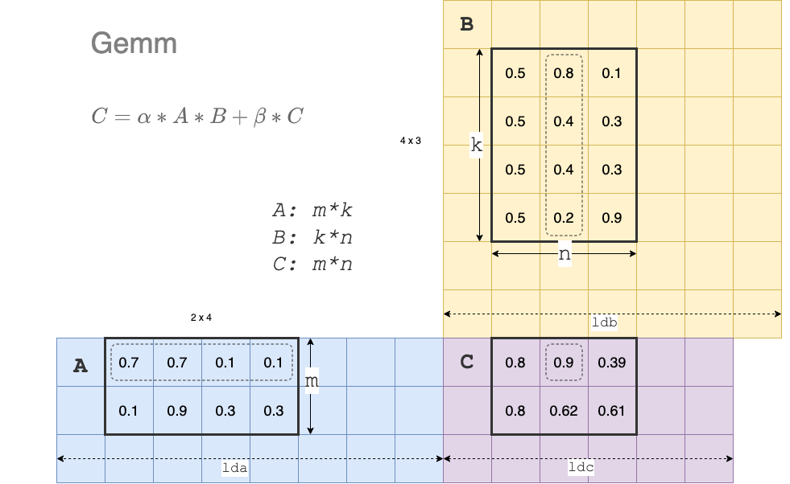

接上回 [VDB-S1E1]()，说了矩阵乘法在向量数据库中的地位，并且引出了`cblas_sgemm`和`cublasSgemmEx`这两个函数

## cblas_sgemm
`cblas_sgemm`是一个通用的矩阵乘法函数，他的定义可以在LAPACK、OpenBLAS、MKL这样的BLAS库中找到。我们看一下他的定义情况：

其实BLAS库中的函数名字都是缩写的组合以`sgemm`为例，可以看作是：`<s><ge><mm>`:
- `s`表示数据类型是单精度浮点，与之对应的还有：
  - `d`: 表示双精度浮点，也就是我们平时编程语言中的`double`
  - `c`: 表示单精度复数
  - `z`: 表示双精度复数
  - `h`：表示Half，或者Float16
- `ge`表示通用矩阵
- `mm`表示矩阵内积（Product）乘操作

`cblas_sgemm` 在OpenBLAS下的函数签名参考如下：
```c++
void cblas_sgemm(const CBLAS_LAYOUT layout, const CBLAS_TRANSPOSE TransA,
                 const CBLAS_TRANSPOSE TransB, const int M, const int N,
                 const int K, const float alpha, const float  *A,
                 const int lda, const float  *B, const int ldb,
                 const float beta, float  *C, const int ldc)
```

好吧，反正如果让我自己去设计的话，是想不出需要这么多参数的。我们慢慢解释这些参数：

首先从数学公式上来说`sgemm`需要解决的数学问题是: $$ C = \alpha * A * B + \beta * C $$

所以上面参数中的 `alpha`, `beta`, `A`, `B`, `C` 就比较明晰了。然后其实剩下来的参数都是围绕着描述`A`,`B`,`C`在内存中的布局情况。

### layout
layout 表明了`A`,`B`,`C`数据在内存上的排序是行排序（CblasRowMajor）还是列排序（CblasColMajor）。

对于一个2*2的矩阵A来说，如果是行排序，则如下：
$$
\begin{bmatrix}
A_0 & A_1 \\\\
A_2 & A_3 \\\\
\end{bmatrix}
$$

而如果是列排序的话，则如下：
$$
\begin{bmatrix}
A_0 & A_2 \\\\
A_1 & A_3 \\\\
\end{bmatrix}
$$

### TransA、TransB
这两个参数则表明了输入的矩阵在计算前是否需要转置。

### M、N、K
这三个参数描述了`A`,`B`,`C`的大小。其中`M`表示`A`和`C`的行数，`N`表示了`B`和`C`的列数，`K`则表示`A`的列数和`B`的行数。

### lda、ldb、ldc
这三个参数则描述了`A`, `B`, `C` 三个矩阵在数据在内存存储、分布的情况。ld 是 leading dimension的缩写。如果是行存储的layout，则可以认为lda描述了一行数据在内存中占用的宽度。因此在行存储的情况下，满足 $ lda >= K $

在行存储的情况下，我们可以通过下图来理解：M、N、K、lda、ldb、ldc等几个参数。



### 代码表示

上面这张图，我们也可以用简单的C++代码来示意。

```c++
#include <vector>
#include <cblas.h>


int main() {
    int lda = 8;
    int ldb = 7;
    int ldc = 6;
    int M = 2;
    int N = 3;
    int K = 4;
    float alpha = 1.0;
    float beta = 0.0;

    std::vector<float> A {
        0.0, 0.7, 0.7, 0.1, 0.1, 0.0, 0.0, 0.0,
        0.0, 0.1, 0.9, 0.3, 0.3, 0.0, 0.0, 0.0,
        0.0, 0.0, 0.0, 0.0, 0.0, 0.0, 0.0, 0.0,
    };

    std::vector<float> B {
        0.0, 0.0, 0.0, 0.0, 0.0, 0.0, 0.0,
        0.0, 0.5, 0.8, 0.1, 0.0, 0.0, 0.0,
        0.0, 0.5, 0.4, 0.3, 0.0, 0.0, 0.0,
        0.0, 0.5, 0.4, 0.3, 0.0, 0.0, 0.0,
        0.0, 0.5, 0.2, 0.9, 0.0, 0.0, 0.0,
        0.0, 0.0, 0.0, 0.0, 0.0, 0.0, 0.0,
        0.0, 0.0, 0.0, 0.0, 0.0, 0.0, 0.0,
    };

    std::vector<float> C {
        0.0, 0.0, 0.0, 0.0, 0.0, 0.0,
        0.0, 0.0, 0.0, 0.0, 0.0, 0.0,
        0.0, 0.0, 0.0, 0.0, 0.0, 0.0,
    };

    cblas_sgemm(CblasRowMajor, CblasNoTrans, CblasNoTrans,
                M, N, K,
                alpha, &A[1], lda,
                &B[8], ldb, 
                beta, &C[1], ldc);
    
    for (auto i=0; i<C.size(); ++i) {
        if (i % ldc == 0) {
            printf("\n");
        }
        printf("%.2f ", C[i]);
    }
    printf("\n");

    return 0;
    
}

```

代码的执行结果如下：
```
0.00 0.80 0.90 0.40 0.00 0.00
0.00 0.80 0.62 0.64 0.00 0.00
0.00 0.00 0.00 0.00 0.00 0.00
```

## cublasSgemmEx
CUDA上提供了其中的一个通用矩阵乘法的函数为`cublasSgemmEx`，其声明如下：
```c++
cublasStatus_t cublasSgemmEx(cublasHandle_t handle,
                           cublasOperation_t transa,
                           cublasOperation_t transb,
                           int m,
                           int n,
                           int k,
                           const float    *alpha,
                           const void     *A,
                           cudaDataType_t Atype,
                           int lda,
                           const void     *B,
                           cudaDataType_t Btype,
                           int ldb,
                           const float    *beta,
                           void           *C,
                           cudaDataType_t Ctype,
                           int ldc)
```

和cblas_sgemm区别：
- 可以看到`cublasSgemmEx`并没有layout参数，在CUDA上为默认列排序。
- Atype，Btype和Ctype，用来描述`A`，`B`，`C`的类型，在CUDA上可以对混合精度的计算。例如：F32，F16，BF16，INT8等。

## What's More
对于`GEMM`算法的效率优化，是一个非常有意思的话题。暂时不展开讨论。在Nvidia GPU上目前cuBLAS的实现Nvidia没有开源，当然Nvidia有开源了[cutlass](https://github.com/NVIDIA/cutlass)，可以作为一个非常好的研究参考。